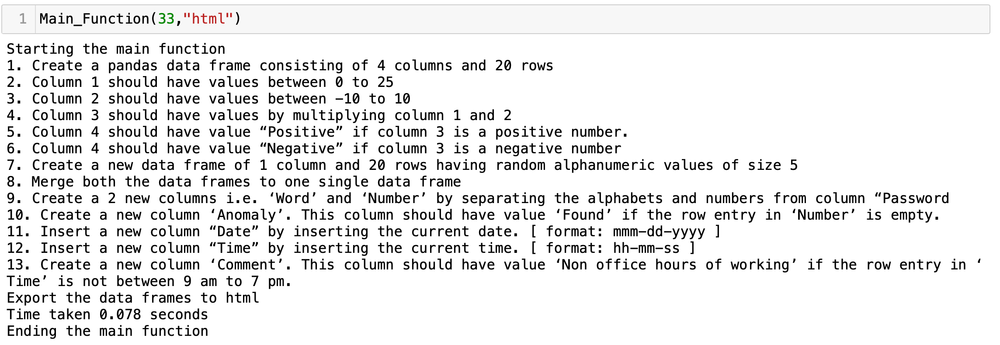

# INTRODUCTION TO PYTHON

## Part I

AIML module project part I consists of stepwise task based assessment which can be accomplished using python programming skills.

1. Create a pandas data frame consisting of 4 columns and 20 rows.
2. Column 1 should have values between 0 to 25.
3. Column 2 should have values between -10 to 10.
4. Column 3 should have values by multiplying column 1 and 2.
5. Column 4 should have value “Positive” if column 3 is a positive number.
6. Column 4 should have value “Negative” if column 3 is a negative number.
7. Create a new data frame of 1 column and 20 rows having random alphanumeric values of size 5. Name the column as ‘Password’
8. Merge both the data frames to one single data frame.
9. Create a 2 new columns i.e. ‘Word’ and ‘Number’ by separating the alphabets and numbers from column “Password”.
10. Create a new column ‘Anomaly’. This column should have value ‘Found’ if the row entry in ‘Number’ is empty.
11. Insert a new column “Date” by inserting the current date. [ format: mmm-dd-yyyy ]
12. Insert a new column “Time” by inserting the current time. [ format: hh-mm-ss ]
13. Create a new column ‘Comment’. This column should have value ‘Non office hours of working’ if the row entry in ‘Time’ is not between 9 am to 7 pm.
14. Export the data frames to excel, csv, html and json formats.
15. Measure and display how much time it takes to execute the code. Optimise your code to reduce the time.

## Part II

- Automate all the tasks listed in part I.
- Your function should be able to create datasets with N rows. [ Where N is defined by the user. N is any integer. ]
- Your function should be able to export datasets onto local machine in excel, csv, json, html or all formats. User can choose this.
- Purpose of this function is to allow user to generate a dataset with N rows and store it on local machine.
- You might need to write a web of complex interrelated functions

**Hint:** You might need to write a web of complex interrelated functions to make a flawless automation. Write individual or interrelated functions to automate steps in part I. Anything that needs just a trigger to start and auto-execute all the steps. Please find the below screenshot for your reference: [ Just a sample for you to visualise. You can be more innovative in your approach ]

